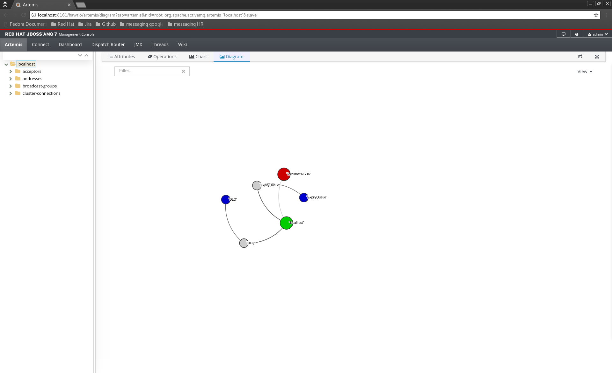

## High Availability of Brokers in AMQ 7 Broker (HA)    

This worksheet covers HA AMQ7 Brokers. By the end of this you should know:

1. Shared Store HA concepts of AMQ7
   * Live/Backup pairs
   * Shared Store HA
   * Non Shared Store HA (replication)
   
2. How to configure HA
   * Configuring Shared Store HA
   * Configuring Clients
   * Configuring Replication 


### AMQ 7 HA Concepts

We define high availability as the *ability for the system to continue
functioning after failure of one or more of the servers*.

A part of high availability is *failover* which we define as the
*ability for client connections to migrate from one server to another in
event of server failure so client applications can continue to operate*.

The AMQ 7 Broker does this by using live/backup pairs where a backup is a
passive broker that will recover the state of a live broker if it crashes or
fails for some reason and take over its duties. There are 2 types of HA with AMQ 7:
* shared store
* replication.

This demo will firstly cover shared store HA to teach the basic concepts of how HA works 
and how clients interact with HA brokers and then a deeper dive into replicated HA.

#### Shared-store HA

Lets start by creating a live/backup pair of brokers using the CLI, to create the live run:

```
$ <AMQ_HOME>/bin/artemis create --allow-anonymous --user admin --password password --cluster-user admin --cluster-password --clustered --shared-store --host localhost --data ../shared-store ../instances/halive1
```
      
and to create the backup run:

```
$ <AMQ_HOME>/bin/artemis create --allow-anonymous --user admin --password password --cluster-user admin --cluster-password --clustered --shared-store --host localhost --data ../shared-store --slave --port-offset 100 ../instances/habackup1
```

The important thing to note here is that the data directory points to the same location, shared store works by sharing
a file lock that the current live broker holds. Once this is released by a server crash then the backup gains the lock 
and loads the journal and becomes live. 

Now start both brokers, you should see the live start and the backup stay passive. You should see something like the following
in the backups log:

```
11:29:51,227 INFO  [org.apache.activemq.artemis.core.server] AMQ221031: backup announced
```

This means that backup has connected to the cluster (of 1) and broadcast its topology, the live brokers then send
this info to clients. You can also see the backup in the hawtIO console, make sure you enable slave brokers in the 
view drop down on the right hand side of the diagram tab, it should look like:



Now lets look at the configurations of the brokers, the first thing you will notice is that both the configurations
both have clustered configs (i.e. `broadcast-groups`, `discovery-groups`, and `cluster-connections`). Even though this is not specifically
a clustered topology the same mechanics are used in sharing the topology with the master node, it also simplifies the
configuration if multiple live/back pairs are deployed in a cluster.

The extra configuration needed by both live and backup is an `ha-policy`. Brokers are given a specific role of either a 
live or backup rather than deciding this at startup time like AMQ 6 does (i.e. the first broker up is live).

The live broker is configured with a shared store policy with the role of master:

```xml
<ha-policy>
  <shared-store>
    <master>
       <failover-on-shutdown>false</failover-on-shutdown>
    </master>
  </shared-store>
</ha-policy>
```
      
The backup broker is also configured with a shared store policy but with the role of slave:

```xml
<ha-policy>
   <shared-store>
      <slave>
         <failover-on-shutdown>false</failover-on-shutdown>
      </slave>
   </shared-store>
</ha-policy>
```
Both brokers have 'failover-on-shutdown' to false, this means that if the live broker is stopped "cleanly" (e.g. via
ctrl-c or the CLI) then the backup will stay passive. Setting this to true will allow failover on a clean shutdown.

Try playing around with stopping or killing the live broker to see the backup take over.
 
Also notice that if you restart a live broker "failback" will occur. This means that the backup will fall back to passive mode
and allow the live to restart. This can be configured on the backup by setting the `allow-failback` config, e.g.:
 
 ```xml
<ha-policy>
   <shared-store>
      <slave>
         <failover-on-shutdown>true</failover-on-shutdown>
         <allow-failback>false</allow-failback>
      </slave>
   </shared-store>
</ha-policy>
```

#### Clients with HA

Configure the live and backup with the same example queue, like so:

```xml
<address name="exampleQueue">
   <anycast>
      <queue name="exampleQueue"/>
   </anycast>
</address>
```

Client Support for HA is only available in the core JMS client and the qpid JMS client. The core JMS client has HA built 
in to the protocol where as qpid JMS leverages what is available in the AMQP protocol so it's feature set is limited. We 
will concentrate on the core JMS client mostly.
 
##### Core JMS Client

HA is configured on the connection factory URL. If using JNDI the jndi.properties would look like this:

```properties
java.naming.factory.initial=org.apache.activemq.artemis.jndi.ActiveMQInitialContextFactory
connectionFactory.ConnectionFactory=tcp://localhost:61616?ha=true&retryInterval=1000&retryIntervalMultiplier=1.0&reconnectAttempts=-1
queue.queue/exampleQueue=exampleQueue
```

The important configuration is `ha=true`. This tells the connection that when disconnected it should retry with the live and its backup.
The rest of the parameters specify how long, how often, and at what interval it should keep retrying.

Now lets run an example sender and receiver by running the following commands:

```bash
$ mvn verify -PHAMessageReceiver
```

and

```bash
$ mvn verify -PHAMessageSender
```

The sender will send 10 messages every 1 second within a local transaction, the receiver will consume 10 messages again in a transaction.

Now kill the live broker and see what happens, you should see the clients log a warning, pause for a while
and then continue:

```
WARN: AMQ212037: Connection failure has been detected: AMQ119015: The connection was disconnected because of server shutdown [code=DISCONNECTED]
```

The failover of the client is completely transparent, however from a JMS API point of view some errors need handling, 
you may have seen the following error in the sending client:

```
tx was rolled back after fail over
```

This error handling has been built into the Client, if you take a look at the 'com.redhat.workshop.amq7.ha.Sender' class
you will see the following:

```java
try {
   session.commit();
} catch (TransactionRolledBackException e) {
   System.out.println("tx was rolled back after fail over");
}
```

This happens because the client failed over during the lifecycle of the transaction, so somewhere between the 1st
message being sent and the transaction being committed. This is because the transaction may have contained non persistent
messages and because the messages are sent async so guarantees can't be held.

Another exception you might see is a JMS Exception with the error code of 'ActiveMQExceptionType.UNBLOCKED'. This happens 
when failover occurs in the middle of a blocking call, such as a transaction commit or sending a persistent message.
Since there is no way of knowing if the call made it to the broker the application needs to decide what to do in this case.

#### qpid JMS client

The qpid JMS client can also be configured to support HA on the connection factory via JNDI:

```properties
java.naming.factory.initial = org.apache.qpid.jms.jndi.JmsInitialContextFactory
connectionfactory.ConnectionFactory = failover:(amqp://localhost:61616)
queue.queue/exampleQueue=exampleQueue
```

The qpid JMS client will transparently reconnect to the backup although unlike the core JMS client you won't see
any warnings. Similarly the qpid JMS client will always rollback transactions that exist when failover occurred.

One major difference is that qpid JMS will not throw an exception on blocking sends, instead it will try to resend.
So for instance when sending a persistent message the client will try to resend it if failover occurs which could
cause duplicates. The same also applies for consumed messages depending on the acknowledgement mode.

make sure the previous core JMS receiver client is running and run the qpid JMS Sender using the command:

```bash
mvn verify -PHAQpidMessageSender
```

Again try killing and restarting the brokers to see what happens.

#### Shared-nothing HA (Replication)

Replication provides HA without the need for a shared data store. Basically the live shares all persistent data it receives
over the network with the backup broker. Basically all data persistent is replicated. As far as clients are concerned live and backups operate exactly
the same as shared store (i.e. if the live fails it can connect to the backup).

Lets start with a simple single master/slave pair, create both brokers by running the following commands:

```sh
$ <AMQ_HOME>/bin/artemis create --allow-anonymous --user admin --password password --cluster-user admin --cluster-password --clustered --replicated --host localhost liveRepl1
```
      
and

```sh
$ <AMQ_HOME>/bin/artemis create --allow-anonymous --user admin --password password --cluster-user admin --cluster-password --clustered --replicated --host localhost --port-offset 100 --slave backupRep1
```
      
Now start both brokers, in the live server you should see something like the following:

```bash
INFO  [org.apache.activemq.artemis.core.server] AMQ221025: Replication: sending AIOSequentialFile:/home/ataylor/devtools/artemis-profiles/liveRepl1/./data/journal/activemq-data-2.amq (size=10,485,760) to replica.
INFO  [org.apache.activemq.artemis.core.server] AMQ221025: Replication: sending NIOSequentialFile /home/ataylor/devtools/artemis-profiles/liveRepl1/./data/bindings/activemq-bindings-4.bindings (size=1,048,576) to replica.
INFO  [org.apache.activemq.artemis.core.server] AMQ221025: Replication: sending NIOSequentialFile /home/ataylor/devtools/artemis-profiles/liveRepl1/./data/bindings/activemq-bindings-2.bindings (size=1,048,576) to replica.
```

and in the backup you should see:

```bash
INFO  [org.apache.activemq.artemis.core.server] AMQ221109: Apache ActiveMQ Artemis Backup Server version 2.0.0.amq-700008-redhat-1 [null] started, waiting live to fail before it gets active
INFO  [org.apache.activemq.artemis.core.server] AMQ221024: Backup server ActiveMQServerImpl::serverUUID=2026f064-5737-11e7-8e99-e8b1fc559583 is synchronized with live-server.
INFO  [org.apache.activemq.artemis.core.server] AMQ221031: backup announced
```

The live and the backup are now synchronized

##### Data Synchronization

Initially before the backup is started the live broker's journal is not replicated, until this happens the broker is not Highly available.
There are several steps that occur before the live broker is highly available, these are:

1. The backup broker once started will try to discover a live broker.
2. The backup broker will then ask the live broker if it can be its replica, if it can't it goes back to step 1.
3. The live broker will then initiate a replication channel back to the backup
4. The live broker then locks the journal and marks its current state, i.e the first and last journal page. It then unlocks the journal and once again serves clients. Note this is a very short period.
5. The journal then sends each journal page to the backup broker.
6. The live once again locks the journal and sends the remaining journal files, that is all the records it has received since the initial journal pages are sent
7. The journal is now synchronized and starts normal replication.
   
Once replication is synchronized then every packet that the live broker receives from a client that carries persistent data such as a message
also gets sent to the backup. Let's use receiving a persistent message as an example to describe how this works:

1. The live broker receives a packet containing a persistent message.
2. In parallel the broker writes the record to its journal and also sends it to the backup.
3. When the backup receives the record and acknowledges receipt to the live, it then asynchronously writes the record to its own journal.
4. The live receives receipt from the backup and then acknowledges receipt to the client.
   
When the backup broker detects a dead live broker, it will finish synching any records to disc and then load in the journal and start.

Kill the live broker and you should see the backup broker start up.

Now restart the live broker to see what happens, what you will see is the live just start as a live server and lots of warnings:

```
WARN  [org.apache.activemq.artemis.core.client] AMQ212034: There are more than one servers on the network broadcasting the same node id. You will see this message exactly once (per node) if a node is restarted, in which case it can be safely ignored. But if it is logged continuously it means you really do have more than one node on the same network active concurrently with the same node id. This could occur if you have a backup node active at the same time as its live node. nodeID=2026f064-5737-11e7-8e99-e8b1fc559583
```

This is a bad thing, we now have 2 brokers serving the same data to clients, extra configuration is needed to avoid this.
Stop the live broker and add `check-for-live-server` to the policy:

```xml
<ha-policy>
   <replication>
      <master>
         <check-for-live-server>true</check-for-live-server>
      </master>
   </replication>
</ha-policy>
```
What you should see is the live broker start and act as a replica to the running backup broker:

```
ERROR [org.apache.activemq.artemis.core.server] AMQ224056: Live server will not fail-back automatically
INFO  [org.apache.activemq.artemis.core.server] AMQ221024: Backup server ActiveMQServerImpl::serverUUID=2026f064-5737-11e7-8e99-e8b1fc559583 is synchronized with live-server.
INFO  [org.apache.activemq.artemis.core.server] AMQ221031: backup announced
```

Now if you kill the backup the live will start.

You can automate this by updating the backup's policy to:

```xml
<ha-policy>
   <replication>
      <slave>
         <allow-failback>true</allow-failback>
      </slave>
   </replication>
</ha-policy>
```
Now try again, you will see the live become a replica and the backup restart in passive mode.

Also try playing about whilst running clients from the shared store section.

   > ##### Note
   > Every time a backup restarts it will create a new journal for the replica, any old journals are kept and stored for safety

##### Detecting Broker Death

Having a single live/backup replicated pair is fine if you have a reliable network, however if there is some sort of Network Outage
then the backup will think the live is dead and start. You can replicate this happening by logging into the console of the live broker,
clicking on the broker (localhost) in the JMX tree on the left and from the operations tab executing the 'freezeReplication' operation.
You will see the backup start and warning messages:

```bash
11:59:27,160 WARN  [org.apache.activemq.artemis.core.client] AMQ212034: There are more than one servers on the network broadcasting the same node id. You will see this message exactly once (per node) if a node is restarted, in which case it can be safely ignored. But if it is logged continuously it means you really do have more than one node on the same network active concurrently with the same node id. This could occur if you have a backup node active at the same time as its live node. nodeID=277fc045-57ff-11e7-a8d4-a32f2682e317
```

Split brain has now occurred.

There are 2 extra configurations you can use to avoid split brain, the first is to make sure there are enough pairs of brokers 
so that the backup can vote for a quorum before its  starts to go live, for this you need a minimum of 3 pairs.

Lets create another 2 pairs of brokers so we have a quorum:

```bash
$ARTEMIS_HOME/bin/artemis create --allow-anonymous --user admin --password password --cluster-user admin --cluster-password --clustered --replicated --host localhost --port-offset 200 liveRepl2
```

```bash
$ARTEMIS_HOME/bin/artemis create --allow-anonymous --user admin --password password --cluster-user admin --cluster-password --clustered --replicated --host localhost --port-offset 300 --slave backupRep2
```

```bash
$ARTEMIS_HOME/bin/artemis create --allow-anonymous --user admin --password password --cluster-user admin --cluster-password --clustered --replicated --host localhost --port-offset 400 liveRepl3
```

```bash     
$ARTEMIS_HOME/bin/artemis create --allow-anonymous --user admin --password password --cluster-user admin --cluster-password --clustered --replicated --host localhost --port-offset 500 --slave backupRep3
```

Now start all of the brokers.

Now log into the admin console of the liverep1 broker and click on the 'freezeReplication' operation and see what happens. 
Since there are 3 pairs in the cluster the backup can now vote for a quorum to decide whether it should start or not. The 
backup will send a vote to the 2 of the live servers (not the live server it is replicating from) and ask it to vote on whether 
it can become live. Each live server then responds true if it to has been disconnected from the backups live or false if
it thinks it is still running. In this case the backups vote will fail and it will return to passive mode until it can reconnect
to a live broker to once again replicate.

Now restart all 6 nodes again and this time kill a live broker by using ctrl-c instead. This time the backups vote will succeed
and the backup will start as live.

