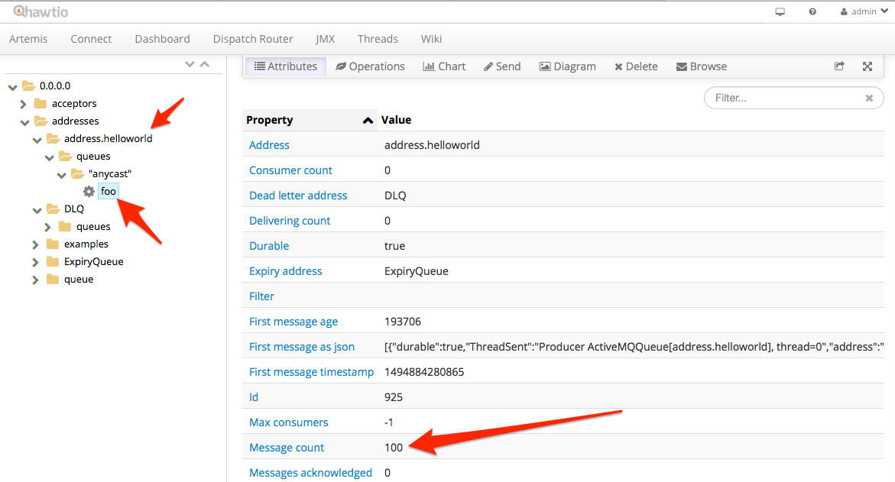
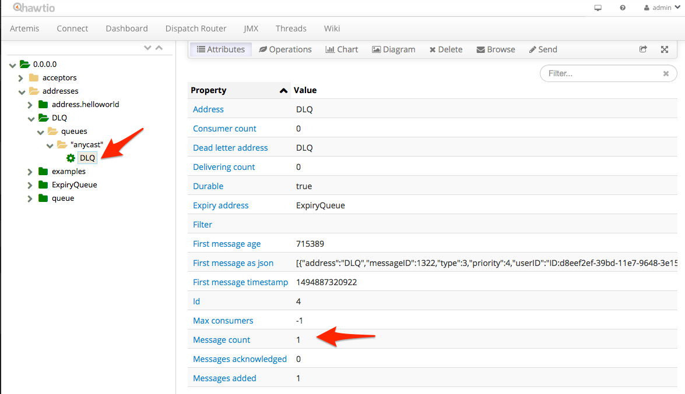

# Producing and Consuming

AMQ7 has many features. We are going to work through a couple of those features, but at the end of this lab you should feel comfortable with some of the basics. We'll leave suggestions at the end for where to learn more about the other features not covered in this lab.

## Use cases:

* Send messages to the broker
* Receive messages from the broker
* Request Reply
* Dead Letter Queue (DLQ)
* Last Value queue


## Before we begin

In the previous labs we've installed and configured our broker. We eliminated the individual ports/protocols and are happy to have all protocols go through the default `Acceptor` at port `61616`. For the remainder of this section, please verify that your broker is running and able to take connections. Each of the next sections assumes this is the case.

### Send 
Let's look at how to easily send and consume messages from a queue. In the [previous lab](./20-clients.md), we explored some of the client APIs. How we send messages to the broker will depend on what programming language and API you wish to use. But what if you just want to quickly test whether the broker is up? Or that some configuration you changed is working as expcted? What if you just want to send some sample load to the broker and don't want to build a producer/client from scratch? Luckily, Artemis comes with some tools for exploring these scenarios.

You should have your `myfirstbroker` running with:

```bash
$ ./bin/artemis run
```
    
This should give you a broker running in the foreground. 

In a different window try running the following command:

```bash
$ ./bin/artemis help producer
```
    
    
This should show a help guide for how to use a simple producer to send messages to the AMQ7 broker.

Let's try sending messages:

```bash
$ ./bin/artemis producer --destination address.helloworld --message-count 100 --url tcp://localhost:61616
```


If we [go to the Broker web console](http://localhost:8161/hawtio) at [http://localhost:8161/hawtio](http://localhost:8161/hawtio) we should see that we now have `100` messages in the `foo` queue. Remember from the first lab, we created a new address called `address.helloworld` and bound it as an `Anycast` address to the `foo` queue.
    
> Note: use the credentials you set when we created the broker; admin/admin    



Let's use the same tools to consume messages.

### Receive

Let' use the same CLI tools to simulate consumption from addresses on the broker. Let's try to consume from the same address `address.helloworld` -- but let's not consume all the messages. Let's start by consuming  `50` of the messages. Just like in the previous section, we want to make sure the broker is up and running and listening on port `61616`. In a separate window, let's take a look at the parameters for the `consumer` command:

```bash
$ ./bin/artemis help consumer
```
    
Now let's try to consume 50 messages from the `foo` queue (remember, our `Anycast` address was bound to `foo`):

```bash
$ ./bin/artemis consumer --destination foo  --message-count=50 --url tcp://localhost:61616
```
    
You should get output similar to this:

```bash
Consumer:: filter = null
Consumer ActiveMQQueue[foo], thread=0 wait until 50 messages are consumed
Consumer ActiveMQQueue[foo], thread=0 Received test message: 0
.
.
.
Consumer ActiveMQQueue[foo], thread=0 Received test message: 39
Consumer ActiveMQQueue[foo], thread=0 Received test message: 40
Consumer ActiveMQQueue[foo], thread=0 Received test message: 41
Consumer ActiveMQQueue[foo], thread=0 Received test message: 42
Consumer ActiveMQQueue[foo], thread=0 Received test message: 43
Consumer ActiveMQQueue[foo], thread=0 Received test message: 44
Consumer ActiveMQQueue[foo], thread=0 Received test message: 45
Consumer ActiveMQQueue[foo], thread=0 Received test message: 46
Consumer ActiveMQQueue[foo], thread=0 Received test message: 47
Consumer ActiveMQQueue[foo], thread=0 Received test message: 48
Consumer ActiveMQQueue[foo], thread=0 Received test message: 49
```


So now if we look at our console, we should see that `50` messages are still left on our queue `foo`:


No go find where your broker is running and let's kill the broker. If we try to consume from the broker at this point, we should see that we cannot establish a connection. When we restart the broker, we exepct our messages to still be on the broker and availabe for consumption. Let's fire up the broker again:

```bash
$ ./bin/artemis run
```
    
Navigate back to the web console and verify we still have `50` messages on the queue `foo`.

Let's consume the last `50` messages:

```bash
$ ./bin/artemis consumer --destination foo  --message-count=50 --url tcp://localhost:61616
```

And we should see our queue is now empty:


###  Request Reply

Messaging is typically used to decouple producers and consumers in two main dimensions: time, and space. When will a consumer see messages? Who knows, but it's not the producer's responsibility. Where do the consumers even live? Again, not a detail a producer should be coupled to. However, there are use cases where producing messages/events will necessitate a response from *some* consumer downstream. You may already have usecases implemented like this using some legacy proprietary queuing system and would like a nice replacement for that legacy system but cannot change your application. However you come across a request-reply usecase here's what it looks like with JBoss AMQ7. 

In the root of the AMQ7 broker installation, there is an `examples` folder. There are a handful of nice examples here. Navigate to:

```bash
$ cd $AMQ7_BASE/examples/features/standard/request-reply
```

Copy the example-settings.xml you used in previous labs to the request-reply directory.  Let's run the example. Note, just like in the previous sections, we need to have a broker running:

```bash
$ mvn -s example-settings.xml verify -DnoServer=true
```

We should see an output like this:

```bash
[INFO] --- artemis-maven-plugin:2.0.0.amq-700005-redhat-1:runClient (runClient) @ request-reply ---
Request message sent.
Received request message: A request message
Reply to queue: ActiveMQTemporaryQueue[d6677193-fef2-4fee-9f8b-d84b08eaff37]
Reply sent
Received reply: A reply message
CorrelatedId: ID:76c9b485-39ba-11e7-b79b-0a0027000003
We found matched request: A request message
[INFO] 
[INFO] --- artemis-maven-plugin:2.0.0.amq-700005-redhat-1:cli (stop) @ request-reply ---
[INFO] ------------------------------------------------------------------------
[INFO] BUILD SUCCESS
[INFO] ------------------------------------------------------------------------
[INFO] Total time: 4.427 s
[INFO] Finished at: 2017-05-15T15:04:27-07:00
[INFO] Final Memory: 37M/457M
[INFO] ------------------------------------------------------------------------
```

So what happened here? We sent a message to a queue and got a response. But what does this look like?

If you open the `Java` source file in the `request-reply` project  `src/main/java//org/apache/activemq/artemis/jms/example/RequestReplyExample.java` we can see a little about how this happens.

First we set up the connection-factory infromation and make a connection to the broker. Then we do the following:

1. Set up the producer

For this, we create a producer to the "request queue" but we also create a temporary destination and attach a consumer to that temporary destination. This simulates the producer sending a message and also waiting for a response on the temporary destination:

```java
 MessageProducer producer = session.createProducer(requestQueue);

 TemporaryQueue replyQueue = session.createTemporaryQueue();

 MessageConsumer replyConsumer = session.createConsumer(replyQueue);
```

Next, we create our message and send it. Before we send it, however, we set a JMS property to specify where the response should be sent. It should, of course, be sent to our temporary destination like we are expecting:

```java
 TextMessage requestMsg = session.createTextMessage("A request message");

 requestMsg.setJMSReplyTo(replyQueue);

 producer.send(requestMsg);
```

We should optionally try to coordinate/correlate the response when it comes back to us. We'll save the message ID or some correlation ID that we specify:

```java
 requestMap.put(requestMsg.getJMSMessageID(), requestMsg);
```

2. Set up the consumer

On the consumer side, we should consume the message like normal (either using a `receive` method or `onMessage` listener) but also check the `ReplyTo` header. We should generate a response and send that response to the destination specified in the `ReplyTo` header:


```java
 public void onMessage(final Message request) {
      try {
         System.out.println("Received request message: " + ((TextMessage) request).getText());

         // Extract the ReplyTo destination
         Destination replyDestination = request.getJMSReplyTo();

         System.out.println("Reply to queue: " + replyDestination);

         // Create the reply message
         TextMessage replyMessage = session.createTextMessage("A reply message");

         // Set the CorrelationID, using message id.
         replyMessage.setJMSCorrelationID(request.getJMSMessageID());

         // Send out the reply message
         replyProducer.send(replyDestination, replyMessage);

         System.out.println("Reply sent");
      } catch (JMSException e) {
         e.printStackTrace();
      }
   }
```


### Dead Letter Queue

What happens when a consumer cannot process a message? Or what happens when a transaction is rolled back? A JMS message in the AMQ7 broker will be redelivered (and possibly to other consumers) if a consumer is having trouble with it. The problem is, we cannot just redeliver for ever because it will starve other consumers and messages it that come later in the queue. To deal with this, we can send the non-consumable message to the "dead letter queue". 

First, we'll need to configure the broker for dead-letter queue (DLQ) behavior. Let's open our `myfirstbroker` configuration file in `etc/broker.xml` and navigate to the `address-settings` location. We should see an entry similar to this:

```xml
         <address-setting match="#">
            <dead-letter-address>DLQ</dead-letter-address>
            <expiry-address>ExpiryQueue</expiry-address>
            <redelivery-delay>0</redelivery-delay>
            <!-- with -1 only the global-max-size is in use for limiting -->
            <max-size-bytes>-1</max-size-bytes>
            <message-counter-history-day-limit>10</message-counter-history-day-limit>
            <address-full-policy>PAGE</address-full-policy>
            <auto-create-queues>true</auto-create-queues>
            <auto-create-addresses>true</auto-create-addresses>
            <auto-create-jms-queues>true</auto-create-jms-queues>
            <auto-create-jms-topics>true</auto-create-jms-topics>
         </address-setting>
```

This configuration sets up a "dead-letter queue" for "#" (which is all, recursive) destinations set to a value of `DLQ`. If you look in the web console, you'll see a queue named `DLQ`.

By default, the max number of retries is `10` but for this lab, we want to change it to a smaller number. Let's change it to `3` by adding a configuration `<max-delivery-attempts>3</max-delivery-attempts>` to our `address-settings`. Your config should look like this:

```xml
         <address-setting match="#">
            <dead-letter-address>DLQ</dead-letter-address>
            <max-delivery-attempts>3</max-delivery-attempts>
            <expiry-address>ExpiryQueue</expiry-address>
            <redelivery-delay>0</redelivery-delay>
            <!-- with -1 only the global-max-size is in use for limiting -->
            <max-size-bytes>-1</max-size-bytes>
            <message-counter-history-day-limit>10</message-counter-history-day-limit>
            <address-full-policy>PAGE</address-full-policy>
            <auto-create-queues>true</auto-create-queues>
            <auto-create-addresses>true</auto-create-addresses>
            <auto-create-jms-queues>true</auto-create-jms-queues>
            <auto-create-jms-topics>true</auto-create-jms-topics>
         </address-setting>
```

Now save your `broker.xml` file. If you had your broker running while you made the change, you should see the configuration auto-reload with a message similar to this in the broker logs:

```bash
15:26:47,336 INFO  [org.apache.activemq.artemis.core.server] AMQ221056: Reloading configuration ...security
15:26:47,339 INFO  [org.apache.activemq.artemis.core.server] AMQ221056: Reloading configuration ...address settings
15:26:47,340 INFO  [org.apache.activemq.artemis.core.server] AMQ221056: Reloading configuration ...diverts
15:26:47,340 INFO  [org.apache.activemq.artemis.core.server] AMQ221056: Reloading configuration ...addresses
15:26:47,351 INFO  [org.apache.activemq.artemis.core.server] AMQ221003: Deploying queue foo
15:26:47,352 INFO  [org.apache.activemq.artemis.core.server] AMQ221003: Deploying queue DLQ
15:26:47,352 INFO  [org.apache.activemq.artemis.core.server] AMQ221003: Deploying queue ExpiryQueue
```

Now, let's go to the `dead-letter` example from the examples that ship with the AMQ7 broker:

```bash
$ cd $AMQ7_BASE/examples/features/standard/dead-letter
```

The example will try to consume messages a few times and try rolling them back 3 times to force the message to the `DLQ` queue. One thing we want to change: we want to configure out example to use `DLQ` as the dead-letter queue. To do this, let's open the `src/main/resources/jndi.properties` file dn change the `queue.queue/deadLetterQueue` to be `DLQ`

Your file should look like this:

```java
java.naming.factory.initial=org.apache.activemq.artemis.jndi.ActiveMQInitialContextFactory
connectionFactory.ConnectionFactory=tcp://localhost:61616
queue.queue/exampleQueue=exampleQueue
queue.queue/deadLetterQueue=DLQ
```

Let's run the example

```bash
$ mvn verify -DnoServer=true
```

We should see output like this:

```bash
Sent message to exampleQueue: this is a text message
1st delivery from exampleQueue: this is a text message
2nd delivery from exampleQueue: this is a text message
3rd delivery from exampleQueue: this is a text message
4th delivery from exampleQueue: null
```

If we check the `DLQ` queue in the web console, we can see that it now has one message in it:



### Last Value queue

A last-value queue is a special kind of queue that keeps only the most recent message for a specific type of message (defined by a `Last-Value` property). This could be useful for stock price updates where we really only care about the most recent updates.  

First, we'll need to configure the broker for last-value queue behavior for the destinations we define. We don't want all of our queues to be last-value, so we need to explicitly set up a specific queue. Let's open our `myfirstbroker` configuration file in `etc/broker.xml` and navigate to the `address-settings` location. We will add a configuration for a queue named `exampleQueue` to be a last-value queue:

```xml
       <address-setting match="exampleQueue">
           <last-value-queue>true</last-value-queue>
       </address-setting>
```

We will also add a new `Anycast` address and bind it to a queue named `exampleQueue`:

```xml
      <address name="exampleQueue">"
          <anycast>
              <queue name="exampleQueue"/>
          </anycast>
      </address>
```


Now, let's go to the `last-value-queue` example from the examples that ship with the AMQ7 broker:

```bash
$ cd $AMQ7_BASE/examples/features/standard/last-value-queue
```

Let's run the example

```bash
$ mvn verify -DnoServer=true
```

We should see output like this:

```bash
[INFO] --- artemis-maven-plugin:2.0.0.amq-700005-redhat-1:runClient (runClient) @ last-value-queue ---
Sent message: 1st message with Last-Value property set
Sent message: 2nd message with Last-Value property set
Sent message: 3rd message with Last-Value property set
Message in the queue: 3rd message with Last-Value property set
Received message: 3rd message with Last-Value property set
Received message: null
```

Let's take a closer look at what's going on. 

If you open the `Java` source file in the `last-value-queue` project  `src/main/java//org/apache/activemq/artemis/jms/example/LastValueQueueExample.java` we can see a little about how this happens.

When we send messages to the `exampleQueue` queue (which was earlier configured for Last Value semantics), we are adding a JMS property named `_AMQ_LVQ_NAME` which is the field that the last-value queue implementation will match on:

```java
         TextMessage message = session.createTextMessage("1st message with Last-Value property set");
         message.setStringProperty("_AMQ_LVQ_NAME", "STOCK_NAME");
         producer.send(message);
```

If the queue sees multiple messages with the same `_AMQ_LVQ_NAME` property, then it will only keep the most recent message. The example sends in three messages with the same value (`_AMQ_LVQ_NAME1` equal to `STOCK_NAME`) and tries to consume from the `exampleQueue` queue. It finds only the 3rd message sent.


## Where to go from here

Check out the examples in the distro
