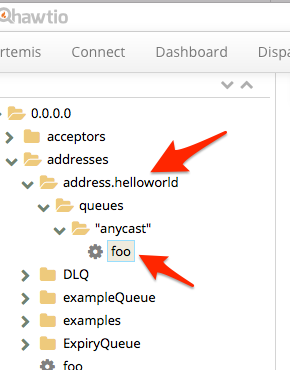

# Connecting the Interconnect Router to an AMQ7 Broker

In this lab we'll take a look at configuring the Interconnect Router to route messages to and from an AMQ7 broker. Clients can talk directly to the router and think they're talking to a broker.

In this lab, we'll use the Docker images from the [installing interconnect router](./80-install-qdr.md) lab. You can use the same configuration files that we'll use here in your full version of RHEL/CentOS if you've installed Interconnect Router there.

First thing we'll do is look at and modify the configuration where needed. If you look in the lab files [for the Interconnect Router configurations](./qdr/conf), you'll see a configuration file named `router-to-broker.conf` that looks like this:


```xml
router {
  mode: standalone
  id: routerToBroker
  workerThreads: 4
}

listener {
  role: normal
  host: 0.0.0.0
  port: 5672
  linkCapacity: 1000
}

log {
  module: DEFAULT
  enable: trace+
  timestamp: true
}

address {
  prefix: foo
  waypoint: yes
}

autoLink {
  addr: foo
  dir: in
  connection: myfirstbrokerConnector
}

autoLink {
  addr: foo
  dir: out
  connection: myfirstbrokerConnector
}

connector {
  host: 10.0.1.35
  name: myfirstbrokerConnector
  port: 61616
  role: route-container
  allowRedirect: no
}


```

In this configuration, we're setting up a `listener` which listens for incoming connections to the router; for example, an AMQP client could connect directly to this listener (in this case, we're listening on port `5672` which is the default AMQP port). Also locate the `connector` section of the configuration. This describes how we'll connect to the AMQ7 broker. You'll want to change the host/port config to match that of your broker. For example, if you're running the broker on your local machine and the router in a docker container locally on a guest OS, you'd want to use your host IP for the broker's `connector.host` field.

Let's make sure our broker from Lab 1, `myfirstbroker` is up and running:

```bash
           __  __  ____    ____            _
     /\   |  \/  |/ __ \  |  _ \          | |
    /  \  | \  / | |  | | | |_) |_ __ ___ | | _____ _ __
   / /\ \ | |\/| | |  | | |  _ <| '__/ _ \| |/ / _ \ '__|
  / ____ \| |  | | |__| | | |_) | | | (_) |   <  __/ |
 /_/    \_\_|  |_|\___\_\ |____/|_|  \___/|_|\_\___|_|

 Red Hat JBoss AMQ 7.0.0.redhat-1


09:42:46,451 INFO  [org.apache.activemq.artemis.integration.bootstrap] AMQ101000: Starting ActiveMQ Artemis Server
09:42:46,467 INFO  [org.apache.activemq.artemis.core.server] AMQ221000: live Message Broker is starting with configuration Broker Configuration (clustered=false,journalDirectory=./data/journal,bindingsDirectory=./data/bindings,largeMessagesDirectory=./data/large-messages,pagingDirectory=./data/paging)
09:42:46,512 INFO  [org.apache.activemq.artemis.core.server] AMQ221013: Using NIO Journal
09:42:46,611 INFO  [org.apache.activemq.artemis.core.server] AMQ221043: Protocol module found: [artemis-server]. Adding protocol support for: CORE
09:42:46,612 INFO  [org.apache.activemq.artemis.core.server] AMQ221043: Protocol module found: [artemis-amqp-protocol]. Adding protocol support for: AMQP
09:42:46,612 INFO  [org.apache.activemq.artemis.core.server] AMQ221043: Protocol module found: [artemis-hornetq-protocol]. Adding protocol support for: HORNETQ
09:42:46,612 INFO  [org.apache.activemq.artemis.core.server] AMQ221043: Protocol module found: [artemis-mqtt-protocol]. Adding protocol support for: MQTT
09:42:46,613 INFO  [org.apache.activemq.artemis.core.server] AMQ221043: Protocol module found: [artemis-openwire-protocol]. Adding protocol support for: OPENWIRE
09:42:46,613 INFO  [org.apache.activemq.artemis.core.server] AMQ221043: Protocol module found: [artemis-stomp-protocol]. Adding protocol support for: STOMP
09:42:46,658 INFO  [org.apache.activemq.artemis.core.server] AMQ221034: Waiting indefinitely to obtain live lock
09:42:46,658 INFO  [org.apache.activemq.artemis.core.server] AMQ221035: Live Server Obtained live lock
09:42:47,152 INFO  [org.apache.activemq.artemis.core.server] AMQ221003: Deploying queue exampleQueue
09:42:47,153 INFO  [org.apache.activemq.artemis.core.server] AMQ221003: Deploying queue foo
09:42:47,153 INFO  [org.apache.activemq.artemis.core.server] AMQ221003: Deploying queue DLQ
09:42:47,154 INFO  [org.apache.activemq.artemis.core.server] AMQ221003: Deploying queue ExpiryQueue
09:42:47,858 INFO  [org.apache.activemq.artemis.core.server] AMQ221020: Started NIO Acceptor at 0.0.0.0:61616 for protocols [CORE,MQTT,AMQP,STOMP,HORNETQ,OPENWIRE]
09:42:47,860 INFO  [org.apache.activemq.artemis.core.server] AMQ221007: Server is now live
09:42:47,860 INFO  [org.apache.activemq.artemis.core.server] AMQ221001: Apache ActiveMQ Artemis Message Broker version 2.0.0.amq-700005-redhat-1 [0.0.0.0, nodeID=ae7bf278-35c4-11e7-97d9-0a0027000001] 
INFO  | main | Initialized artemis-plugin plugin
INFO  | main | Initialized dispatch-hawtio-console plugin
09:42:50,441 INFO  [org.apache.activemq.artemis] AMQ241001: HTTP Server started at http://localhost:8161
09:42:50,441 INFO  [org.apache.activemq.artemis] AMQ241002: Artemis Jolokia REST API available at http://localhost:8161/jolokia
```

Now let's try running the Interconnect Router with the above configuration (ie, change the `connector` host IP and port to match your settings):

```bash
docker run -it --rm --name qdr -p 5672:5672 -v $(pwd)/qdr/conf/router-to-broker.conf:/etc/qpid-dispatch/qdrouterd.conf ceposta/qdr 
```

Note how we map the configuration file into the docker container. When we run this, we should see output from the Interconnect Router similar to this:

```bash
Thu May 25 09:46:19 2017 SERVER (trace) Connecting to 10.0.1.35:61616
Thu May 25 09:46:19 2017 SERVER (trace) [1]:  -> SASL
Thu May 25 09:46:19 2017 SERVER (trace) [1]:  <- SASL
Thu May 25 09:46:19 2017 SERVER (trace) [1]:0 <- @sasl-mechanisms(64) [sasl-server-mechanisms=@PN_SYMBOL[:PLAIN, :ANONYMOUS]]
Thu May 25 09:46:19 2017 SERVER (trace) [1]:0 -> @sasl-init(65) [mechanism=:ANONYMOUS, initial-response=b"anonymous@0993bdacc124"]
Thu May 25 09:46:19 2017 SERVER (trace) [1]:0 <- @sasl-outcome(68) [code=0]
Thu May 25 09:46:19 2017 SERVER (trace) [1]:  <- AMQP
Thu May 25 09:46:19 2017 SERVER (trace) [1]:  -> AMQP
Thu May 25 09:46:19 2017 SERVER (trace) [1]:0 -> @open(16) [container-id="routerToBroker", hostname="10.0.1.35", max-frame-size=16384, channel-max=32767, idle-time-out=8000, offered-capabilities=:"ANONYMOUS-RELAY", properties={:product="qpid-dispatch-router", :version="0.8.0"}]
Thu May 25 09:46:19 2017 SERVER (trace) [1]:0 <- @open(16) [container-id="0.0.0.0", max-frame-size=4294967295, channel-max=65535, idle-time-out=30000, offered-capabilities=@PN_SYMBOL[:"sole-connection-for-container", :"DELAYED_DELIVERY", :"SHARED-SUBS", :"ANONYMOUS-RELAY"], properties={:product="apache-activemq-artemis", :version="2.0.0.amq-700005-redhat-1"}]
Thu May 25 09:46:19 2017 ROUTER_CORE (trace) Core action 'connection_opened'
Thu May 25 09:46:19 2017 ROUTER_CORE (info) Auto Link Activated 'autoLink/0' on connection myfirstbrokerConnector
Thu May 25 09:46:19 2017 ROUTER_CORE (info) Auto Link Activated 'autoLink/1' on connection myfirstbrokerConnector
Thu May 25 09:46:19 2017 SERVER (trace) [1]:0 -> @begin(17) [next-outgoing-id=0, incoming-window=2147483647, outgoing-window=2147483647]
Thu May 25 09:46:19 2017 SERVER (trace) [1]:1 -> @begin(17) [next-outgoing-id=0, incoming-window=2147483647, outgoing-window=2147483647]
Thu May 25 09:46:19 2017 SERVER (trace) [1]:0 -> @attach(18) [name="qdlink.nxYIQdO8Jvut7LX", handle=0, role=true, snd-settle-mode=2, rcv-settle-mode=0, source=@source(40) [address="foo", durable=0, expiry-policy=:"link-detach", timeout=0, dynamic=false], target=@target(41) [durable=0, timeout=0, dynamic=false], initial-delivery-count=0, max-message-size=0]
Thu May 25 09:46:19 2017 SERVER (trace) [1]:1 -> @attach(18) [name="qdlink.NqqnFJ7_SOW_EWu", handle=0, role=false, snd-settle-mode=2, rcv-settle-mode=0, source=@source(40) [durable=0, timeout=0, dynamic=false], target=@target(41) [address="foo", durable=0, expiry-policy=:"link-detach", timeout=0, dynamic=false], initial-delivery-count=0, max-message-size=0]
Thu May 25 09:46:19 2017 SERVER (trace) [1]:0 <- @begin(17) [remote-channel=0, next-outgoing-id=1, incoming-window=2147483647, outgoing-window=2147483647, handle-max=65535]
Thu May 25 09:46:19 2017 SERVER (trace) [1]:1 <- @begin(17) [remote-channel=1, next-outgoing-id=1, incoming-window=2147483647, outgoing-window=2147483647, handle-max=65535]
Thu May 25 09:46:19 2017 SERVER (trace) [1]:0 <- @attach(18) [name="qdlink.nxYIQdO8Jvut7LX", handle=0, role=false, snd-settle-mode=2, rcv-settle-mode=0, source=@source(40) [address="foo", durable=0, expiry-policy=:"link-detach"], target=@target(41) [], incomplete-unsettled=false, initial-delivery-count=0]
Thu May 25 09:46:19 2017 SERVER (trace) [1]:1 <- @attach(18) [name="qdlink.NqqnFJ7_SOW_EWu", handle=0, role=true, snd-settle-mode=2, rcv-settle-mode=0, source=@source(40) [], target=@target(41) [address="foo", durable=0, expiry-policy=:"link-detach"]]
Thu May 25 09:46:19 2017 SERVER (trace) [1]:1 <- @flow(19) [next-incoming-id=0, incoming-window=2147483647, next-outgoing-id=1, outgoing-window=2147483647, handle=0, delivery-count=0, link-credit=1000]
Thu May 25 09:46:19 2017 ROUTER_CORE (trace) Core action 'link_second_attach'
Thu May 25 09:46:19 2017 ROUTER_CORE (trace) Core action 'link_second_attach'
Thu May 25 09:46:19 2017 ROUTER_CORE (trace) Core action 'link_flow'
```

Fire up the web console for the broker at [http://localhost:8161/hawtio](http://localhost:8161/hawtio) and try to find the `address.hellowrold` destination. 



As we send messages in to the router, you should watch the `foo` queue and see its message count increase.

### Sending messages into the Router

To send messages into the router, we'll go [back to the JMS AMQP client in the Clients Lab](./20-clients.md) and configure it to send messages to the `5672` port (which is the default AMQP port:
 
 Our `jndi.properties` file should look like this, with the `connectionfactory.myFactoryLookup` property set to `5672`
 
 ```
 # Set the InitialContextFactory class to use
 java.naming.factory.initial = org.apache.qpid.jms.jndi.JmsInitialContextFactory
 
 # Define the required ConnectionFactory instances
 # connectionfactory.<JNDI-lookup-name> = <URI>
 connectionfactory.myFactoryLookup = amqp://localhost:5672
 
 # Configure the necessary Queue and Topic objects
 # queue.<JNDI-lookup-name> = <queue-name>
 # topic.<JNDI-lookup-name> = <topic-name>
 queue.myQueueLookup = queue
 topic.myTopicLookup = topic
 ```
 
The last thing we need to do is port-forward the guest OS to our host OS. If you recall, when we started the docker container for our router, we passed in the `-p 5672:5672` flag which exposes the `5672` port on the docker container to the host. Except, since the docker daemon is running in our guest VM, it cannot be seen on the host. 
 
If using minikube, do this achieve the port forwarding:

```bash
minikube ssh -- -vnNTL *:5672:$(minikube ip):5672 
```

Now run your JMS client:

```bash
java -cp "target/classes/:target/dependency/*" org.apache.qpid.jms.example.HelloWorld
Hello world!
```

If we see the `Hello world!` response, it means our message went to the router, into the broker, and back out that way to the JMS consumer as we expected! 